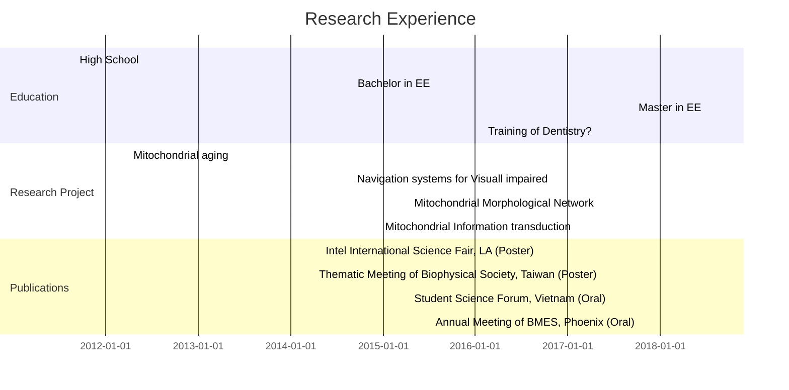

---
slideOptions:
  transition: slide
---

# Hello!

---


### Shao-Ting Chiu (Steven)

* Electrical Engineering (Bachelor degree)
    * National Taiwan University

----


### Shao-Ting Chiu (Steven)

* Dental Surgery (3$^{\text{rd}}$ year)
    * National Yang-Ming University

---

### Programming Skill
|Python|Matlab|C++|
|---|---|---|
|:satisfied:|:worried:|:fearful:|

---

### When do I use Python?

1. Deal with Mathematical equations
    * Scipy 
2. Data Visualization
    * Scipy | Matplotlib
4. Machine Learning
    * Keras
5. Interact with other languages
    * Netlogo

----

**Netlogo** is a programming language for agent-based modeling


A mitochondrial Netlogo model from [Giovanni Dalmasso et al.](http://journals.plos.org/plosone/article?id=10.1371/journal.pone.0168198)

---

Research Experience



---

The State of Parental Mitochondria Influences the Relicative Lifespan of Zygotes of *S. cerevisiae*

||
|---|---|

----

<iframe src="//www.slideshare.net/slideshow/embed_code/key/9p1ZBp34ZXy9sT" width="668" height="600" frameborder="0" marginwidth="0" marginheight="0" scrolling="no" style="border:1px solid #CCC; border-width:1px; margin-bottom:5px; max-width: 100%;" allowfullscreen> </iframe> 

[PDF text](https://drive.google.com/open?id=0B0fatyRgBBHgbHh6VGs0YnF1RzA)

---

:::info
Definition

Replicative lifespan (RLS) is the maximum number of daughter cells that a mother cell can produce. 
:::


---

What will happen if a old cell mates with a young cell?

||
|---|---|

* The resulting old x young zygotes possess intermidiate lifespan.

---

What are **necessary conditions** of the rejuvenation during yeast mating process?


----

* YFunc: Young functional mitochondria
* YmtD: Young mtDNA

---

* Mitochondrial are necessary for rejuvenation.


----

* YFunc: Young functional mitochondria
* YmtD: Young mtDNA

---

* Even young cells with dysfuctional mitochondria can still rejuvenate old cells.


----

* YFunc: Young functional mitochondria
* YmtD: Young mtDNA

---

### Conclusions

1. The old x young zygotes poccess intermediate lifespan compared to parent cells.
2. Young mitochondria are essential for the rejuvenation
3. Young copies of Cox1, Cox2, Cox3 in mitochondrial genome may be essential for rejuvenation process in yeast.

---

What have I learned in this project?

1. Mitochondria are mysterious. 
2. Instead of doing repetitive experiments, systems biology may provide insights about aging.

:point_right: Join engineering

---

### A Spectral Information Coding System for the Visually Impaired


----

<iframe src="//www.slideshare.net/slideshow/embed_code/key/4ZKhB8JI9De1Mf" width="668" height="600" frameborder="0" marginwidth="0" marginheight="0" scrolling="no" style="border:1px solid #CCC; border-width:1px; margin-bottom:5px; max-width: 100%;" allowfullscreen> </iframe> 

[PDF text](https://drive.google.com/open?id=0B0fatyRgBBHgNG1ZbjlTM1FQWjA)

---

What did I learn?

1. Writing code on embedded system.
2. Real-time image processing and recognition
    * Tensorflow is demanding
    * I love Keras

---

### The Influences of Mitochondrial Depolarization on Mitochondrial Network Structures

----

<iframe src="//www.slideshare.net/slideshow/embed_code/key/gUCqnCDvgI5taB" width="668" height="600" frameborder="0" marginwidth="0" marginheight="0" scrolling="no" style="border:1px solid #CCC; border-width:1px; margin-bottom:5px; max-width: 100%;" allowfullscreen> </iframe> 

[PDF text](https://drive.google.com/open?id=0B0fatyRgBBHgaDR2MFZ4T090WUk)

---

```flow
st=>start: FCCP treatment
e=>end: Machine learning
op=>operation: 3D imaging
op2=>operation: Image processing (Mitograph)
op3=>operation: Network analysis

st->op->op2->op3->e
```

---

Training by Covolutional Neural Network
```python=
# Parameters
learning_rate = 0.005
training_epochs = 1500

#batch_size = 100
display_step = 50

# Network Parameters
n_hidden_1 = 33 # 1st layer num features
n_hidden_2 = 15 # 2nd layer num features
n_input = train_x.shape[1] #5 inputs
n_classes = 2 # classes (2 digit)

# Create model
def multilayer_perceptron(_X, _weights, _biases):
    #Hidden layer with RELU activation
    layer_1 = tf.nn.relu(tf.add(tf.matmul(_X, _weights['h1']), _biases['b1'])) 
    #Hidden layer with RELU activation
    layer_2 = tf.nn.relu(tf.add(tf.matmul(layer_1, _weights['h2']), _biases['b2'])) 
    return tf.matmul(layer_2, weights['out']) + biases['out']
```

---

What did I learn?

1. 3D mitochondrial imaging by DeltaVision :weary:
2. 3D image processing :expressionless:
3. Machine learning :smile:
    *  I love Keras

---

### Information Transduction Capacity of Mitochondrial Retrograde Signaling

----

<iframe src="//www.slideshare.net/slideshow/embed_code/key/7lYZZqDtsBviAC" width="668" height="600" frameborder="0" marginwidth="0" marginheight="0" scrolling="no" style="border:1px solid #CCC; borer-width:1px; margin-bottom:5px; max-width: 100%;" allowfullscreen> </iframe> 

[PDF text](https://drive.google.com/open?id=1Obb_khYINJXLkHioExCmpfqcc3JKQmLl)


---


---


---


---

#### Diagram of differential equation-based model


---


---

Information Theory can be used to describe the information-transmission quality of mitochondrial retrograde signalling

* Shannon's Information
    $$H(S)=-\sum_{s\in S}P(s) logP(s)$$
    where  S is a random variable
* Mutual information
    $$I(S;R) =H(S)-H(S|R)$$ 
* Channel capacity
    $$C = max_{P_{S}(\cdot)}I(S;R)$$
     where C is the channel capacity  

---

#### What do I expect to do in JHMI?
* Modeling & Simulation 
    * Agent-based modeling
    * ODE-based modeling
    * Information theory
* Data Analysis
    * Machine learning
    * Statistics

---

Nice to meet you!