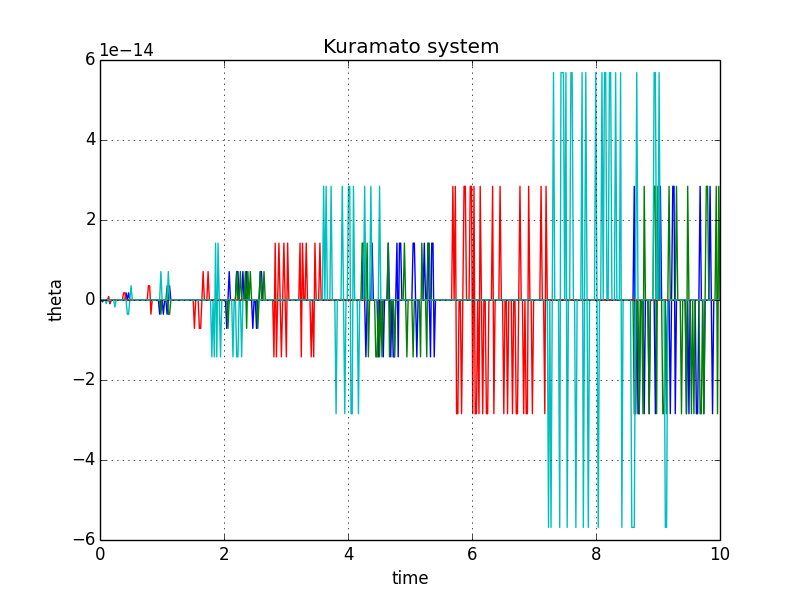

 
# JHMI Paper Notes 20180716-18

:memo:**Objectives**
Today's topic is **network synchronization**. 
* Paper reading provides examples of derivation of sufficient requirements by using [Lyapunov approach](https://en.wikipedia.org/wiki/Lyapunov_stability)
* Book reading provides formal dervitation and knowledgement about synchronization in complex system.
* Talk with Dr. Brian O'Rourke about the synchronization requirement for cardial mitochondria.

---
- [ ] Paper reading
    - [ ] Synchronization of coupling oscillator
    - [ ] Cluster synchornization in networks of coupled nonidentical dynamical system
- [ ] Book reading
    - [ ] Synchronization in complex networks
- [ ] Discussion with Dr. Brian O'Rourke
    - [ ] Asking about single cell mitochondrial oscillation data
- [ ] Proposal Writing

---

[TOC]

# Cluster synchornization in networks of coupled nonidentical dynamical system

# Synchronization in complex networks

# Synchronization of Coupling Oscillator Dynamics

## Objectives

* Derive sufficient conditions for sunchronization of selected benchmark oscillators which are linearly coupled.
* Use Lyapunov approach to obtain sufficiency condition for synchronization of coupled oscillators.
* Study synchronization of Van der Pol oscillators and Fitzhugh Nagumo oscillators with all-to-all connectivity.

## Definition of Synchronization

:bulb:**Synchronization**

A set of coupled oscillators are said to be *synchronized* if the difference between corresponding stated become consant *asymptotically*.

## Kuramoto Coupled Oscillator

$$
\dot{\theta_{i}} = \omega_{i} + \frac{K}{n}\sum^{n}_{j=1} sin(\theta_{j} - \theta_{i})
$$

$i \in 1,...,n$

where, $\theta_{i}$ is phase, $\omega_{i}$ is natural frequency and K is coupling gain of the oscillator

[Source code](kuramoto-model.py)

## Van der Pol oscillatior

### Single Van der Pol Oscillator

$$\begin{aligned}
\dot{x_{i}} &= \mu (x_{i} - y_{i} - \frac{1}{3}x_{i}^{3}) \\
\dot{y_{i}} &= \frac{1}{\mu}x_{i}
\end{aligned}$$

### Coupled Van der Pol Oscillator

$$\begin{aligned}
\dot{x_{i}} &= \mu (x_{i} - y_{i} - \frac{1}{3}x_{i}^{3}) + K\sum^{N}_{p=1}(x_{p}-x_{i}) \\
\dot{y_{i}} &= \frac{1}{\mu}x_{i},
\end{aligned}$$

where $i, j = (1,...,N)$

### Synchronization of coupled Van der pol oscillator

* $|x_j - x_i| = \text{constant}$ as $t\rightarrow \infty \forall i,j=(1,...,N)$
    $\Rightarrow|\dot{x_j} - \dot{x_i}| = 0$
* $|y_j - y_i| = \text{constant}$ as $t\rightarrow \infty \forall i,j=(1,...,N)$
$\Rightarrow|\dot{y_j} - \dot{y_i}| = 0$

### Derivation of sufficient conditions of synchronization

### Conclusion

**Synchronization of Van der Pol oscillator**

Couple Van der Pol oscillators sybchronize asymptotically, if coupling gain $K \geq \mu/N$

# Discussion with Dr. Brian O’Rourke

:question: What are the sufficient conditions that make synchronized mitochondrial oscillation occur?
[:memo:Ref]()

:question:How to synchronize mitochondiral oscillation in single cell?
[:memo:Ref:Synchronize mitochondria network](http://www.jbc.org/content/278/45/44735)

:bulb: 

::

:::success
**Modulation of synchronization on mitochondrial oscillation in single cell**

:::

# Proposal Writing

## Model

## Assumptions
* Assume there a mitochondrial network poccesses $N$ mitochondria.
* For each mitochondrion

$$\dot{\phi_{i}} = f(\sum_{j=1}^{N} \phi_{j}, damaged_{i}),$$

for $j=(1,...,N)$, $damaged_{i} = \{0,1\}$

## Objective

* To find the condition that 

$$|\phi_{i} - \phi_j| = \text{constant}$$ as $t\rightarrow \infty \forall i,j = (1,...,N)$

* To find the condition that 

$$|\phi_{i} - \phi_j| = f(t)$$ 
as $t\rightarrow \infty \forall i,j = (1,...,N)$

where $\dot{f}(t) \neq 0$ as $t\rightarrow \infty$

## Method
